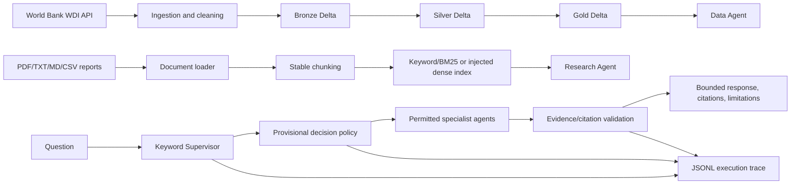

# Architecture

## Data flow

The existing ingestion notebooks own the WDI Medallion path. Retrieval reads document chunks and does not write to or replace the Gold table. Local unit tests use in-memory documents and CSV fixtures; no Spark or network is required.

`src/workflows/agent_graph.py` provides the local workflow runner and an optional LangGraph adapter (`pip install .[agents]`). The runner validates input, routes, calls bounded specialists, validates source references, synthesizes a partial or evidence-backed response, records a decision, and emits a JSONL trace. The local research fallback quotes retrieved passages; it does not call an LLM.

Financial and project agents remain explicit unavailable-source responses until a verified dataset/schema is selected. Documents & Reports metadata search stays separate from local full-text retrieval; an abstract is labeled metadata/abstract evidence, not report body text.

## Interfaces

- Shared document/chunk records: `src/retrieval/document_loader.py`, `chunking.py`.
- Retriever protocol and implementations: `src/retrieval/retrievers.py`.
- Local JSON vector store: `src/retrieval/vector_store.py`.
- Context and generator contract: `src/retrieval/context.py`.
- Typed decisions: `src/decision/schemas.py`; policy: `src/decision/policy.py`.
- Structured evidence checks: `src/agents/validation_agent.py`.
- Run trace: `src/utils/workflow_logging.py`.

No managed vector search, LLM serving, Databricks Apps deployment, or workspace execution was verified here.
