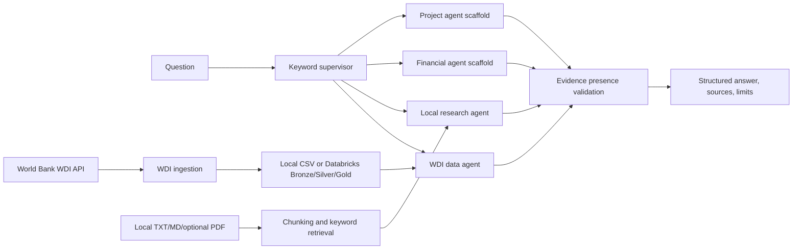

# World Bank Intelligence & Decision AI

A modular student prototype for querying World Bank development data and local research documents. The local path is runnable without Databricks, an LLM, or a vector database. Databricks notebooks demonstrate a separate Spark/Delta path.

## Repository structure

```text
app/                  Local command-line interface
config/               Sample settings
data/                 Local raw and processed data paths
evaluation/           Evaluation question set and metric helpers
notebooks/             Databricks WDI, Delta, quality, and query examples
src/agents/            Structured results, specialist agents, routing, validation
src/data/              WDI API, cleaning, CSV adapters, safe query tools
src/retrieval/         Local document loading, chunking, keyword retrieval
src/workflows/         Bounded agent workflow and optional LangGraph wrapper
src/utils/              Configuration and SQL identifier allowlists
tests/                 Unit and local workflow integration tests
```

See [REQUIREMENTS_TRACEABILITY.md](REQUIREMENTS_TRACEABILITY.md) for each proposal item’s implementation status, missing work, and validation method.

## Architecture and data flow



The local supervisor uses a transparent keyword baseline. The WDI agent filters a loaded dataset through explicit country, indicator, and year arguments; it never builds SQL from a question. The research agent returns literal retrieved passages with file and chunk references. The workflow runs each selected agent once, validates source presence, and returns a structured response. Its validator does not prove that every claim is entailed by its source.

## Local setup

Python 3.10 or newer is required.

### Windows PowerShell

```powershell
py -m venv .venv
.\.venv\Scripts\Activate.ps1
python -m pip install --upgrade pip
pip install -r requirements.txt
```

### Linux or macOS shell

```bash
python3 -m venv .venv
source .venv/bin/activate
python -m pip install --upgrade pip
pip install -r requirements.txt
```

Optional features:

```powershell
# PDF text extraction (only needed when local source documents include PDFs)
pip install ".[documents]"
# LangGraph wrapper (the standard local workflow does not need this)
pip install ".[agents]"
```

Copy `.env.example` to `.env` only if you need local settings. WDI public API access does not require credentials. Never store secrets in `.env.example` or commit `.env`.

## WDI ingestion

From the repository root, fetch a small real sample from the official World Bank Indicators API:

```powershell
python -m src.data.world_bank_ingestion --country GBR --indicators NY.GDP.MKTP.CD,SP.POP.TOTL --start-year 2020 --end-year 2022 --output data/processed/wdi_sample.csv
```

`--country` also accepts comma-separated country codes, for example `--country GBR,USA`. Request settings can be overridden with `--timeout`, `--max-retries`, `--per-page`, and `--base-url`; defaults can also come from `.env`.

The command writes cleaned indicator rows to `data/processed/wdi_sample.csv` and archives each raw JSON API page separately under `data/raw/wdi/` (override with `--raw-output-dir`). Each processed row contains country and indicator metadata, year, the API value (blank when the source value is missing), the exact source page URL, and an ISO-8601 UTC ingestion timestamp. The API client includes pagination, request timeouts, bounded exponential retry, input checks, and null preservation. Raw and processed data paths are ignored by Git.

To run the local WDI ingestion unit tests without network access:

```powershell
python -m pytest tests/test_world_bank_ingestion.py
```

## Ask the local workflow

With the sample CSV present, run:

```powershell
python -m app.app --question "Show GDP trends for GBR from 2020 to 2022" --wdi-csv data/processed/wdi_sample.csv
```

For machine-readable structured output:

```powershell
python -m app.app --question "Show GDP trends for GBR from 2020 to 2022" --wdi-csv data/processed/wdi_sample.csv --json
```

To include a search of the public World Bank Documents & Reports metadata API, pass `--search-world-bank-documents`:

```powershell
python -m app.app --question "education policy and school resilience" --search-world-bank-documents
```

This requires internet access. It retrieves paginated document metadata and abstracts, with official record and PDF URLs. It does not download or extract remote PDFs.

To include local research evidence, put `.txt` or `.md` files in a folder and pass `--documents-folder path/to/folder`. PDFs are supported after installing the optional `documents` extra. Local retrieval is deterministic keyword overlap; it is not embedding-based semantic search. Retrieved text is treated as untrusted evidence and not as instructions.

If the data or documents do not support an answer, the workflow reports insufficient evidence or a partial result. Finance and project queries remain partial until a dataset and safe query tool are configured.

## Tests and evaluation helpers

Run all local tests from the repository root:

```powershell
python -m pytest
```

Tests use synthetic records and mocked HTTP responses; they do not require live APIs, Databricks, or external model services. Coverage includes WDI pagination/retries/edge cases, CSV schema checks, safe table names, query filtering, local retrieval, workflow output, routing, and evaluation helper formulas.

Evaluation helpers in `evaluation/evaluation_metrics.py` calculate retrieval precision/recall at k, exact-match routing accuracy, ingestion and agent success rates, data validation pass rate, citation coverage, manually labelled faithfulness/factual consistency rates, and mean measured latency. Faithfulness and factual consistency require human labels; citation coverage counts references but does not score semantic support. The sample question CSV is a seed set, not a validated gold-standard benchmark. No quality scores are claimed until a labelled evaluation run has been performed.

## Databricks path

1. Import the repository through Databricks Git folders or another supported method.
2. Configure `DATABRICKS_CATALOG`, `DATABRICKS_SCHEMA`, `DEFAULT_COUNTRY`, and `WDI_INDICATORS` for the target workspace.
3. Run `notebooks/01_wdi_ingestion.py` to fetch WDI data on configured compute.
4. Run `notebooks/02_delta_medallion.py` to write Bronze, Silver, and Gold Delta tables. Each run performs an idempotent full refresh; incremental merge is not implemented.
5. Run `notebooks/03_data_quality.py` and `notebooks/04_first_agent_test.py` to inspect data and exercise the allowlisted query example.

The notebooks use Spark and Delta and have not been executed against this user’s workspace. Catalog permissions, Unity Catalog, compute, model serving, Vector Search, MLflow features, and Databricks Apps depend on workspace entitlements. The local CLI and local lexical retriever are the alternatives where those services are unavailable.

## Implemented sources and limitations

- **WDI:** working public API ingestion for one or more countries and multiple indicators per invocation; local CSV output and tested filters.
- **Projects & Operations and Finances One:** CSV adapters validate caller-supplied columns. No schema is hardcoded because a specific project export or Finances One dataset has not been selected.
- **Documents & Reports:** official metadata and abstract search is connected; remote PDF downloading/extraction is not. Local TXT/Markdown and optional PDF ingestion are implemented.
- **UK sources:** generic CSV adapter only; exact ONS, OHID Fingertips, or NHS England datasets and fields must be selected before implementation.
- **Agents:** WDI and local research paths work in the local workflow. Finance/project agents are explicit placeholders. Model-backed reasoning is not configured.
- **JEV:** the repository has no formal definition or reference. The keyword router remains a baseline and is not labelled JEV.
- **Evidence validation:** source references and citation gaps are surfaced. Claim-level entailment, contradiction detection, and causal inference are not implemented. Descriptive trends do not establish causation.
- **Databricks:** notebooks are configuration-dependent examples. Managed service availability and workspace execution remain unverified.

## Source documentation

- [World Bank Indicators API v2](https://datahelpdesk.worldbank.org/knowledgebase/articles/898581-api-basic-call-structures)
- [World Bank Projects API and source example](https://blogs.worldbank.org/en/opendata/first-steps-in-integrating-open-data)
- [World Bank Documents & Reports API](https://documents.worldbank.org/en/publication/documents-reports/api)
- [World Bank Data API overview](https://datahelpdesk.worldbank.org/knowledgebase/articles/889386-developer-information-overview)
- [Example Finances One dataset with API service](https://financesone.worldbank.org/d/DS04621)
